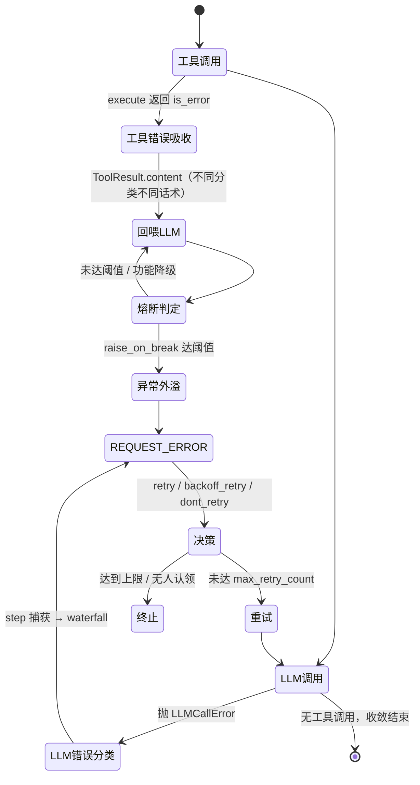

## 版本

| 版本 | 更新内容 |
| ---- | -------- |
| 1.0 | 创建初稿：工具调用错误分类与话术、LLM 错误分类与重试策略两条链路 |
| 1.1 | 同步 ToolExecuteError 改为工具调用错误父类的分类树 |
| 1.2 | 补充指向 known-limitations"工具熔断抛错时机与人在回路挂点缺失"的交叉引用 |
| 1.3 | ToolResult 状态收敛为 `error_type` 枚举（新增 `ToolErrorType`、移除 `is_parse_error`、`is_error` 改为派生），错误分类矩阵同步 |

# 数据流：Agent Loop 错误处理

**Flow 对象**：错误（工具调用错误、LLM 调用错误）
**对应 Spec**：暂无（`docs/specs` 尚未建立）；分类与策略依据见下方相关文档的 ADR

## Flow 对象数据结构

### 1. 工具调用产物 ToolResult（工具层对外唯一产物）

```
ToolResult
# 回喂内容
content: str                    # 给 LLM 的文本：正常结果，或错误信息 + hint

# 分类标记（状态唯一来源）
error_type: ToolErrorType | None # None=成功；非 None=失败并标明属于哪一类

# 派生
is_error: bool                  # = error_type is not None；ToolRegister 熔断计数的依据

# 构造入口
ToolResult.error(content, error_type)  # 失败结果的快捷构造（必须给分类）
```

**关键字段说明**：
- `error_type`：失败分类的**唯一来源**，取值见 `ToolErrorType`（`tool.py`）。枚举与下文的错误分类矩阵一一对应：`TOOL_NOT_FOUND` / `PARSE_ERROR` / `PARSE_TRUNCATED` / `PARSE_NOT_OBJECT` / `PARAM_VALIDATION` / `TOOL_EXECUTION` / `BREAKER_INTERCEPT`。用于观测/评估定位"错在哪一类"（各类错误占比、高频失败类型）。
- `is_error`：由 `error_type` 派生，驱动 [\_on_failure](file:///d:/desktop/软件开发/agent/src/myagent/agent/core/tool/register.py#L350) 累加连续失败计数、并在阈值处触发熔断；成功一次则清零。

> 历史：曾用 `is_error` + `is_parse_error` 两个布尔位表达状态，`is_parse_error` 因"为某一类错误单开布尔位、不可扩展"被移除，统一收敛为 `error_type`。

### 2. LLM 错误分类树（按"来源"分类）

```
LLMCallError                 # 基类：LLM 层翻译 SDK 异常后的领域异常
├── LLMAuthError             # 配置类：认证失败（401）
├── LLMModelError            # 配置类：模型/接入点不存在（404）
├── LLMEndpointError         # 配置类：base_url 错误/不可达
├── LLMRateLimitError        # 限流配额类：限流（429）
├── LLMQuotaError            # 限流配额类：配额不足/余额用尽
├── LLMConnectionError       # 连接类：网络断开/上游瞬时不可达
└── LLMContextExceededError  # 请求内容类：上下文超长

LLmError                     # request/error 无人认领时由 loop 抛出

ToolExecuteError             # 工具调用错误的父类
├── ToolValueError           # 工具注册/注销输入非法
├── ToolValidateParameterError       # 工具参数未过 schema 校验（工具层内部消化，不外溢）
└── ToolConsecutiveFailureError      # 工具熔断且 raise_on_break 时抛出（工具错误唯一外溢路径）
```

**关键字段说明**：分类主轴是**错误来源**（稳定），恢复策略不写在类型上，而放在独立策略注册表（易变）——见 ADR `2026-09-09-LLM错误处理分类策略`。

### 3. request/error 决策与退避参数

```
RequestErrorPayLoad
error_type: Exception        # 抛出的异常实例（LLM 错误 / 超时 / 步数上限 RuntimeError / 工具熔断）

决策返回值（waterfall 订阅方 LLMRerty 返回 → loop 消费）
decision: Literal["retry", "backoff_retry", "dont_retry"]
policy:   dict | None        # 仅 retry / backoff_retry 携带，形如 {base_delay, multiplier, cap}

RetryPolicy（loop 侧承接为 frozen dataclass）
base_delay: float = 0.0      # 第 1 次重试的等待秒数
multiplier: float = 1.0      # 每次重试等待的放大倍数
cap: float = inf             # 等待时长封顶
```

**关键字段说明**：`decision=None`（无订阅方或订阅方未认领）在 loop 中视为"错误无人认领"，抛 `LLmError`；`policy` 仅在有重试决策时存在。

## 与其他数据流的耦合

### 错误处理 ↔ Session

**Session 承载的错误相关记录**：`step/end`、`turn/end`（含 `reason_type` / `reason_text`）、`llm/retry`、`assistant/chunk`（finish 块 `finish_reason="error"`）、`tool/result`（`is_error`）。

**耦合关系**：

| 错误处理节点 | Session 影响 | 触发位置 |
| ------------ | ------------ | -------- |
| LLM 调用失败 | 保留已产出 chunk（append-only），补一条 `finish_reason="error"` 的 finish 块；不补 `assistant/message` | `_ask_model` |
| 决定重试 | 追加 `llm/retry` 记录（既是"决定重试"的事实，也是下轮 attempt 计数的来源） | `_handle_step_error` |
| 一轮结束 | 写 `step/end`（本轮终态）；重试耗尽时 `reason_type="error"` | `step` 的 `finally` |
| 整轮结束 | 写 `turn/end`，汇总本轮终态（success / interrupted / error） | `turn` 的 `finally` |
| 工具调用失败 | 写 `tool/result`（`is_error=True`）并把 `content` 回喂模型 | `step` 工具循环 |

### 错误处理 ↔ 工具熔断状态

**ToolRegister 熔断状态字段**：`_consecutive_failures`（本 turn 连续失败次数）、`_tripped`（本 turn 已熔断工具集）。

**耦合关系**：

| 错误节点 | 熔断影响 | 触发位置 |
| -------- | -------- | -------- |
| 解析失败 / 校验失败 / 执行失败 | 连续失败计数 +1 | `_on_failure` |
| 成功一次 | 计数清零 | `execute` |
| 计数达阈值 | 加入 `_tripped`；按 `breaker_mode` 走 schema_hide 或 execute_intercept；`raise_on_break` 时抛异常 | `_on_failure` |
| 每个 turn 结束 | `reset_breaker` 清空计数与已熔断集合（下一 turn 恢复可用） | `TURN_END` 回调 |

<key_function>
- src/myagent/agent/core/tool/register.py
  - register.ToolRegister.parse_call:236
  - register.ToolRegister.execute:290
  - register.ToolRegister._on_failure:350
  - register.ToolRegister.reset_breaker:372
- src/myagent/agent/core/agent/loop.py
  - loop.ReActAgentLoop.turn:178
  - loop.ReActAgentLoop.step:229
  - loop.ReActAgentLoop._ask_model:342
  - loop.ReActAgentLoop._handle_step_error:385
  - loop.ReActAgentLoop.retry_delay:417
- src/myagent/agent/llm/llm_retry.py
  - llm_retry.LLMRerty.request_error_event:33
</key_function>

## 流程概览



> 工具错误默认在 `execute` 内被吸收为 `is_error` 的 `ToolResult`（不外溢）；只有 `raise_on_break` 熔断才会以异常形式外溢，与 LLM 错误汇入同一条 `request/error` 决策链。

## 数据流节点

**业务场景说明**：两条链路——工具调用错误（不外溢、转错误信息回喂 LLM）、LLM 调用错误（分类 + 重试策略）。

## 链路 1：工具调用错误（在工具层吸收，转错误信息回喂 LLM）

设计原则：**工具内部错误不外溢**，一律转成 `is_error=True` 的 `ToolResult`，作为 `role="tool"` 消息回喂 LLM 自纠；**不同分类给 LLM 的错误信息不同**（话术分流）。

1. ToolRegister.execute()
   执行一次工具调用：先解析 wire 参数，再校验、执行
   状态: 返回 ToolResult（is_error 标记）| 持久化: ❌ | 跨模块: ❌
   步骤: `parse_call` 解析 arguments → 工具存在性检查 → 熔断拦截(execute_intercept) → 参数校验 → 工具执行 → 失败则 `_on_failure` 计数

**工具错误分类 → 回喂话术 → 熔断 矩阵**（这是链路 1 的核心，体现"错误信息不一样"）：

| 分类 | 触发点 | `error_type` | 回喂 LLM 的话术 | 计入熔断 |
| ---- | ------ | ------------ | --------------- | -------- |
| 工具不存在/未注册 | `execute:311-314` | `TOOL_NOT_FOUND` | 工具名 + 可用工具列表 | 否（无熔断对象）|
| 解析失败·普通语法错误 | `parse_call:270-277` | `PARSE_ERROR` | 原文 + `JSONDecodeError` 位置 + hint「对照错误位置修正后重新调用」 | 是 |
| 解析失败·截断(truncated) | `parse_call:270-277` | `PARSE_TRUNCATED` | 原文 + hint「因 max_tokens 被截断，精简参数/拆分调用」 | 是 |
| 解析结果非 JSON 对象 | `parse_call:279-288` | `PARSE_NOT_OBJECT` | 得到的类型 + hint「arguments 必须是 {...}，重新调用」 | 是 |
| 参数校验失败 | `execute:339-345` | `PARAM_VALIDATION` | 参数 + 校验错误信息 + hint「分析错误后重新调用」 | 是 |
| 工具执行异常 | `execute:346-353` | `TOOL_EXECUTION` | hint「工具内部错误，重试若仍不可行建议放弃该工具」 | 是 |
| 熔断拦截(execute_intercept) | `execute:320-325` | `BREAKER_INTERCEPT` | 已熔断次数 + hint「本轮不可再调用，改用其他工具」 | 否 |
| 熔断功能降级(schema_hide) | `_on_failure:378-383` | 沿用底层 `error_type`（追加 hint）| 原结果 + hint「连续失败已熔断，改用其他工具」 | 是（触发当次）|
| 熔断抛错(raise_on_break) | `_on_failure:373-377` | —（抛 `ToolConsecutiveFailureError`）| — | 是 |

2. ToolRegister._on_failure()
   记录一次失败并处理熔断触发
   状态: `_consecutive_failures` 累加；达阈值进 `_tripped` | 持久化: ❌ | 跨模块: ❌
   步骤: 无熔断配置直接返回 → 计数+1 → 未达阈值返回 → 达阈值按 `raise_on_break` 抛错 / 否则给结果追加熔断 hint

> **唯一外溢路径**：`raise_on_break=True` 的工具在连续失败达阈值时抛 `ToolConsecutiveFailureError`。它由 step 的 `TaskGroup` 包成 `ExceptionGroup` 上抛，被 `step` 的 `except ExceptionGroup` 取出，记入 `step_error`，走 `request/error`（与 LLM 错误同一条决策链）。

## 链路 2：LLM 调用错误（分类 + 重试策略）

1. ReActAgentLoop._ask_model()
   消费模型流；失败时补齐现场并原样抛出
   状态: 保留已产出 chunk，补 finish 块 | 持久化: ✅（session.append）| 跨模块: loop→llm
   步骤: 正常走完 → append `assistant/message`；中途抛 `LLMCallError` → 若本次无 finish 块则补一条 `finish_reason="error"` → 原样 `raise`

2. ReActAgentLoop.step()
   捕获 LLM 错误（单点捕获），驱动重试
   状态: `result` 终态；重试轮次 → `step/end` | 持久化: ✅ | 跨模块: ❌
   步骤: `except LLMCallError` → 记入 `step_error` → `finally` 交给 `_handle_step_error` → 重试耗尽则记 error 并 break

3. ReActAgentLoop._handle_step_error()
   触发 request/error 决策，执行计数/上限/退避
   状态: 可能追加 `llm/retry` | 持久化: ✅ | 跨模块: loop→策略注册表
   步骤: `trigger(REQUEST_ERROR)` → 取 `decision` → 无决策抛 `LLmError` → 非重试决策返回 None → 计算 attempt → 超 `max_retry_count` 返回终止原因 → 写 `llm/retry` → `retry_delay` 等待

**LLM 错误来源 → 决策 映射**（策略注册表 `LLMRerty`，未命中则 `_next()` 交链上下一个订阅方）：

| 来源类型 | decision | 退避档 | 说明 |
| -------- | -------- | ------ | ---- |
| `retry_type`（当前为空）| retry | base=0 | 立即重试；当前无类型登记 |
| `LLMRateLimitError` / `LLMQuotaError` / `LLMConnectionError` | backoff_retry | base=1.0s, ×2, cap=30s | 延迟重试 |
| `LLMAuthError` / `LLMModelError` / `LLMEndpointError` / `LLMContextExceededError` | dont_retry | — | 不重试；不等待，循环继续（由 step_limit 兜底）|
| 未命中（含仅抛基类 `LLMCallError`）| 交 `_next()` | — | 链上无人认领 → loop 抛 `LLmError` |

4. LLMRerty.request_error_event()
   request/error 的 waterfall 订阅方：按异常类型查重试策略
   状态: 返回 `{decision, policy}` 控制信号 | 持久化: ❌ | 跨模块: llm→core(loop 消费)
   步骤: `isinstance` 匹配三类元组 → 返回对应 decision（+policy）→ 未命中 `_next()`

5. ReActAgentLoop.retry_delay()
   计算并等待第 attempt 次重试的退避时长
   状态: 返回实际等待秒数 | 持久化: ❌ | 跨模块: ❌
   步骤: `delay = min(base × multiplier^(attempt-1), cap)` → 错误带 `details["retry_after"]` 时取 `max(delay, retry_after)` → `asyncio.sleep(delay)`

**重试计数**：`attempt = session.llm_retry_count(turn) + 1`；`attempt > AgentConfig.max_retry_count` 时不再重试，返回终止原因文本（形如 `"10/10 达到最大重试错误：..."`）。

## 异常与清理

| 场景 | 处理 | 是否走 request/error | 位置 |
| ---- | ---- | -------------------- | ---- |
| LLM 调用失败 `LLMCallError` | 补 error finish 块 → step 单点捕获 → `_handle_step_error` | 是 | `_ask_model` / `step` |
| LLM 调用超时 `TimeoutError` | step 捕获记 `step_error`，走同一决策链；无 `details`，取不到 `retry_after` | 是 | `step` |
| 用户取消 `CancelledError` | step/turn 记 `interrupted` 后原样上抛，`_loop` 捕获 warning + break（结束循环） | 否（单独处理）| `step` / `turn` / `_loop` |
| 工具熔断抛错 `ToolConsecutiveFailureError` | 经 `ExceptionGroup` 取出记 `step_error`，同批其余异常仅记 warning 丢弃 | 是 | `step` |
| 步数上限 `step_limit` | 抛 `RuntimeError` 记入 `request/error`；`result` 记 error 并 break | 是 | `step` |
| 未归一化异常 | step/turn 先把本轮终态记为 error 再原样上抛，最外层 `_on_loop_done` 记录 error 日志（含堆栈）| 否 | `step` / `turn` / `_on_loop_done` |
| 每个 turn 结束 | `TURN_END` 回调触发 `reset_breaker`，清空熔断状态 | — | `__init__` 接线 |

## 反常设计说明

### 1. `execute` 的 `except Exception` 把"代码错误"与"工具错误"混为一谈

**设计意图**：工具内部错误不外溢，转成错误信息回喂 LLM 自纠。
**当前实现**：`execute:338-341` 用 `except Exception` 兜住校验与执行阶段的**所有**异常，统一返回话术"属于工具内部错误，重试后若不可行建议放弃该工具"。
**为什么是反常的**：该分支同时吞掉了工具的运行期失败（网络/超时/依赖不可用，属预期故障）与框架/工具的编程 bug（`AttributeError`、schema 非法、`deepcopy` 失败、`multipleOf=0` 的 `ZeroDivisionError` 等）。前者降级合理，后者被伪装成"工具内部错误"后，LLM 会误判为自身参数问题而反复重试直到 `step_limit`，真正的 bug 也被业务日志淹没。代码注释已自认"暂时的写法，这里工具调用错误还需要分类进行"。
**影响范围**：错误可观测性与定位效率；熔断计数被非工具原因消耗。
**相关位置**：[register.py#L338-L341](file:///d:/desktop/软件开发/agent/src/myagent/agent/core/tool/register.py#L338-L341)

### 2. "工具错误不外溢"存在设计外的逃逸口

**设计意图**：所有工具调用错误都在 `ToolRegister` 内被吸收为 `ToolResult`。
**当前实现**：`parse_call:255-258` 只捕获 `JSONDecodeError`；`json.loads` 在 `arguments` 非 str/bytes（如 dict/list）时抛 `TypeError`，在坏字节时抛 `UnicodeDecodeError`，二者会穿透 `execute`（`parse_call` 调用在 try 之外）。此外 `tool.breaker_mode`（`execute:317`）、`_on_failure` 内的属性访问也在 try 之外。
**为什么是反常的**：实现与"不外溢"的声明不一致；这类异常会经 `TaskGroup` 变成 `ExceptionGroup` 上抛，被 `step` 的 `except ExceptionGroup` 当作"非熔断异常"整组上抛，最终使整个 turn 记为 error。
**影响范围**：模型输出被协议层污染（如 provider 传 dict）时，agent 不降级而是中断本 turn。
**相关位置**：[register.py#L255-L258](file:///d:/desktop/软件开发/agent/src/myagent/agent/core/tool/register.py#L255-L258)

### 3. `_validate_param` 的 except 可能引用未绑定变量

**设计意图**：把类型归一化产生的 `ValueError` / `TypeError` 包装成 `ToolValidateParameterError`，并带上出错字段。
**当前实现**：`_validate_param:151-159` 中 `deepcopy(parameters)` 位于循环之前；若它在绑定 `parameter_name` / `parameter_value` 之前抛出 `ValueError`/`TypeError`，except 分支引用这两个未绑定变量会改为抛 `UnboundLocalError`。
**为什么是反常的**：报错信息从"哪个字段出错"退化为变量未绑定的内部错误，掩盖原始失败原因（`UnboundLocalError` 仍属 `Exception`，最终被 `execute` 的兜底话术吸收）。
**影响范围**：参数校验的错误定位能力。
**相关位置**：[register.py#L151-L159](file:///d:/desktop/软件开发/agent/src/myagent/agent/core/tool/register.py#L151-L159)

## 相关文档

### 已知限制
- **工具熔断抛错时机与人在回路挂点缺失**：`docs/known-limitations/2026-09-11-工具熔断抛错时机与人在回路挂点缺失.md` - 链路 1"唯一外溢路径"（`raise_on_break`）在写完 `tool/result` 前抛出带来的会话/终态问题，以及人在回路异步挂点缺失

### ADR
- **LLM 错误处理分类策略**：`docs/adr/2026-09-09-LLM错误处理分类策略.md` - 按来源分类 + 独立策略注册表
- **工具调用解析与截断处置移入工具层**：`docs/adr/2026-09-10-工具调用解析与截断处置移入工具层.md` - 解析失败转 ToolResult 回喂，截断由 truncated 标记承载
- **LLM 调用失败时的 session 补齐策略**：`docs/adr/2026-09-10-LLM调用失败时的session补齐策略.md` - 补 error finish 块、不回滚、不补 message
- **LLM 重试延迟退避策略**：`docs/adr/2026-09-10-LLM重试延迟退避策略.md` - 统一指数退避公式 + 参数放注册表 + Retry-After
- **工具调用截断与 JSON 解析错误分类（已取代）**：`docs/adr/2026-09-09-工具调用截断与JSON解析错误分类.md` - 截断三成因分析来源

### 架构文档
- **架构地图**：`docs/ARCHITECTURE.md` - 模块层级与依赖
